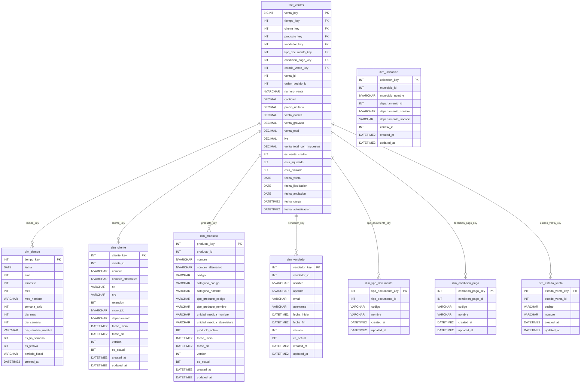
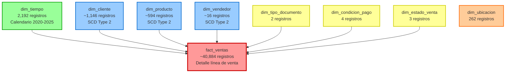
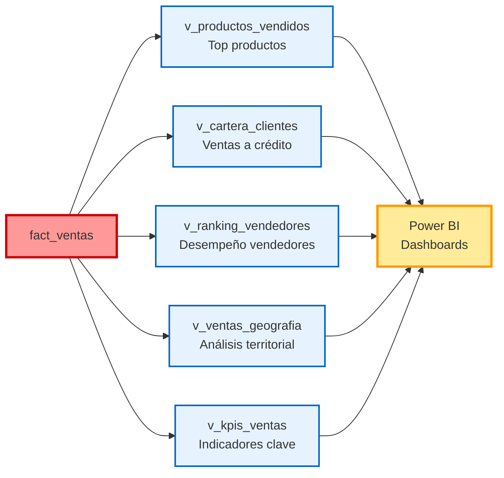
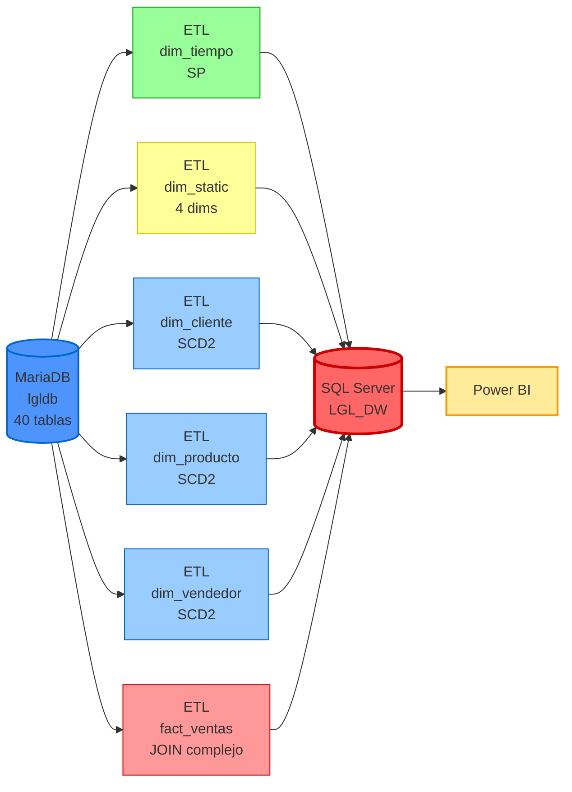
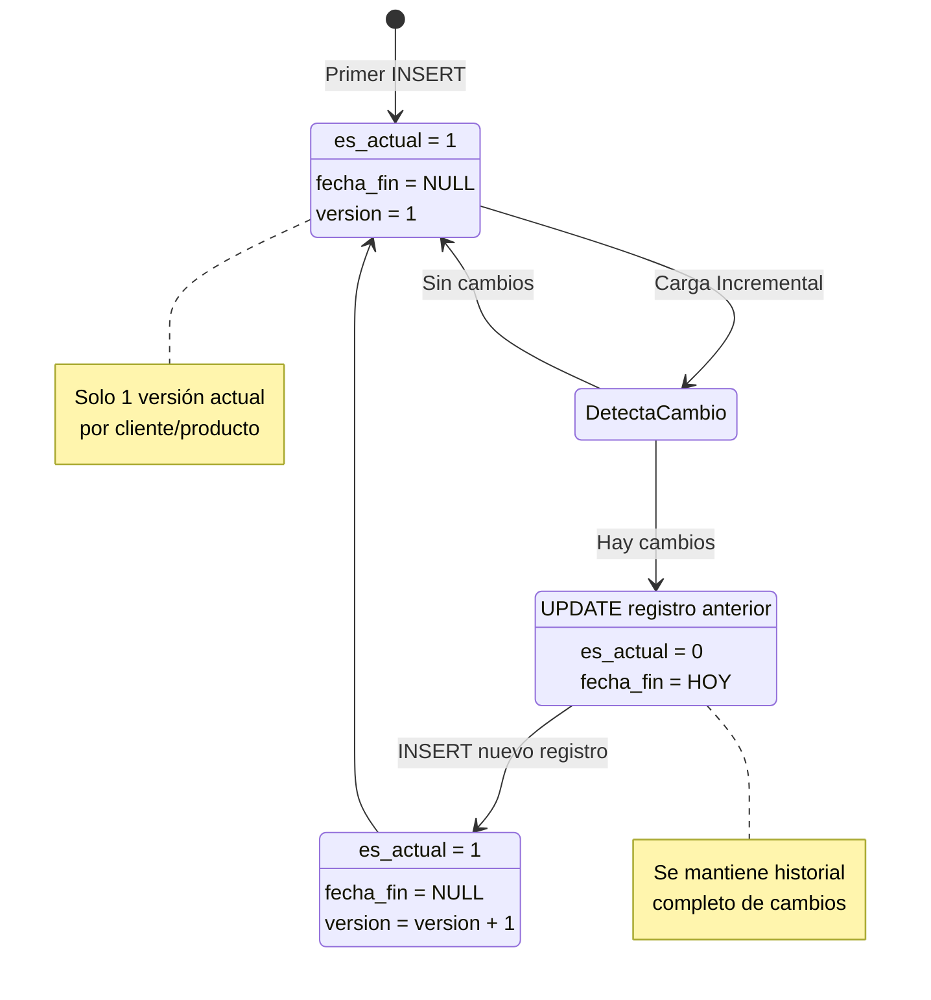

# Diagrama del Data Warehouse - LGL

## Esquema Completo (Star Schema)

---

## Esquema Simplificado (Vista General)

**Leyenda:**
- 🔴 Rojo: Tabla de Hechos
- 🔵 Azul: Dimensiones SCD Type 2
- 🟢 Verde: Dimensión Tiempo
- 🟡 Amarillo: Dimensiones Estáticas
- 🟠 Naranja: Dimensión Geográfica

---

## Modelo de Negocio (Vistas Analíticas)

---

## Flujo de Datos (ETL)

---

## SCD Type 2 - Versionamiento

---

## Métricas y Cardinalidad

| Componente | Tipo | Registros | Crecimiento |
|------------|------|-----------|-------------|
| dim_tiempo | Dimensión | 2,192 | Anual (+365) |
| dim_tipo_documento | Dimensión | 2 | Estático |
| dim_condicion_pago | Dimensión | 4 | Estático |
| dim_estado_venta | Dimensión | 3 | Estático |
| dim_ubicacion | Dimensión | 262 | Estático |
| dim_cliente | Dimensión SCD2 | ~1,146 | Incremental |
| dim_producto | Dimensión SCD2 | ~594 | Incremental |
| dim_vendedor | Dimensión SCD2 | ~16 | Incremental |
| **fact_ventas** | **Hecho** | **~40,884** | **Diario** |

**Período actual:** 2018-02-01 a 2023-07-01 (5.4 años)  
**Venta total:** $1,471,206.11  
**Ventas únicas:** 17,317  
**Clientes activos:** 971  
**Productos vendidos:** 344

---

## Uso en Documentos

Puedes copiar cualquiera de estos diagramas en:
- README.md
- Documentación técnica
- Presentaciones (GitHub/GitLab renderiza Mermaid)
- Confluence, Notion, etc.

**Renderizado:** La mayoría de plataformas modernas renderizan Mermaid automáticamente.
