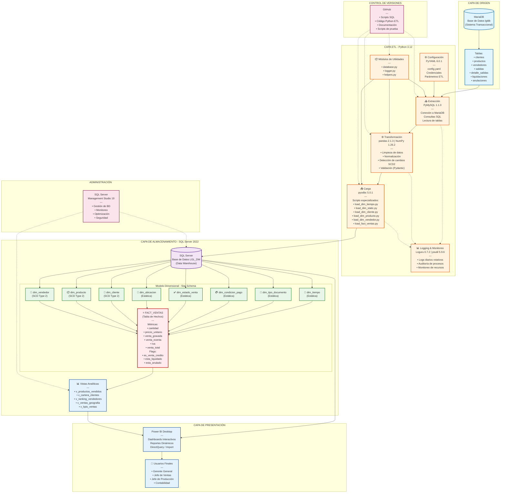

# Capitulo II: Análisis y diseño de la propuesta de solución 

Una vez definidos los fundamentos y la especificación del proyecto en el capítulo anterior, el presente capítulo se aboca al análisis y diseño técnico de la solución de inteligencia de negocios. En esta fase se traslada la necesidad empresarial identificada a una propuesta técnica concreta y viable. Para ello, se detalla la metodología de trabajo que guiará el desarrollo, se describe en profundidad la propuesta de solución y se especifica el stack tecnológico seleccionado para su construcción. Asimismo, se presenta el diagrama arquitectónico que representa integralmente el sistema y se desglosa la función de cada uno de sus componentes, sentando así las bases técnicas para la etapa de implementación. 

## Metodología de trabajo 

La metodología de trabajo del proyecto se divide en dos grandes fases: una orientada a la investigación del estado actual y otra al desarrollo de la solución propuesta.

### Metodología para la fase de investigación 

Para el levantamiento de información se emplearán técnicas cualitativas como la entrevista semiestructurada, la observación directa y la revisión documental. Estas herramientas permitirán identificar entradas, salidas y procesos relevantes dentro del sistema transaccional de la empresa, así como las necesidades y dificultades que enfrenta la gerencia en la obtención de información útil para la toma de decisiones. 

Los principales actores involucrados en esta etapa serán: el encargado de generar reportes gerenciales, el personal técnico responsable del sistema actual, y representantes de la gerencia general. La información obtenida será documentada y validada a través de reuniones de retroalimentación para asegurar su pertinencia y veracidad. 

### Metodología para la fase de desarrollo (Scrum adaptado con elementos de Kanban) 

La fase de desarrollo seguirá una metodología ágil basada en Scrum, adaptada a las características del equipo y complementada con elementos de Kanban para la gestión visual del flujo de trabajo (ScrumBan). 

El equipo de desarrollo estará compuesto por tres miembros, quienes asumirán los roles de Product Owner, Scrum Master y Desarrolladores, todos asignados internamente. El desarrollo se organizará en ciclos iterativos (sprints) de dos semanas, con reuniones semanales para revisar avances, planificar nuevas tareas y discutir posibles impedimentos. 

La gestión de tareas se realizará mediante tableros en la plataforma Trello, utilizando columnas que representen los estados de cada tarea (Por hacer, En proceso, En revisión, Completado). Esto permitirá una visualización clara del progreso y facilitará la identificación de cuellos de botella. 

Al finalizar cada sprint, se llevará a cabo una revisión del entregable correspondiente y una retrospectiva para identificar oportunidades de mejora. Los criterios de aceptación de cada módulo o componente estarán definidos previamente y validados por el Product Owner. 

Este enfoque metodológico permitirá al equipo responder de forma ágil a los cambios, priorizar correctamente los requerimientos y asegurar una entrega continua de valor para la empresa. 

## Descripción de la propuesta de solución  

La propuesta de solución consiste en diseñar, desarrollar e implementar una arquitectura de inteligencia de negocios basada en un Data Warehouse, que sirva como plataforma para centralizar, integrar y analizar los datos relacionados con el proceso de ventas de la empresa LGL S.A. de C.V. 

La solución contempla la extracción de datos desde la fuente existente: un sistema transaccional desarrollado en MariaDB (anteriormente MySQL), encargado de la gestión de inventarios y facturación. A través de procesos ETL desarrollados en Python, utilizando las librerías PyMySQL y pyodbc para la conexión directa con las bases de datos, estos datos son extraídos, depurados, transformados y cargados en una nueva base de datos dimensional en SQL Server, alojada en un servidor físico distinto al del sistema operacional. 

Este Data Warehouse implementa un modelo dimensional tipo estrella (Star Schema) según el enfoque de Kimball, compuesto por ocho dimensiones y una tabla de hechos. Las dimensiones incluyen: tiempo, tipo de documento, condición de pago, estado de venta, ubicación, cliente, producto y vendedor. Las tres últimas dimensiones (cliente, producto y vendedor) implementan la técnica Slowly Changing Dimension Type 2 (SCD Type 2), lo que permite mantener un historial completo de los cambios en estos registros a lo largo del tiempo, preservando versiones anteriores y actuales de cada entidad. La tabla de hechos está orientada al proceso de ventas, conteniendo métricas de cantidad, precio, ventas gravadas, exentas, IVA y totales, con un nivel de granularidad correspondiente a cada línea de detalle de venta. 

Los procesos ETL están completamente desarrollados en Python, organizados en una arquitectura modular que incluye: 
- Scripts especializados para la carga de cada dimensión (estáticas y SCD Type 2) 
- Script para la carga de la tabla de hechos con soporte de carga incremental por fechas 
- Módulos de utilidades para conexiones a bases de datos, logging estructurado y funciones de transformación 
- Sistema de logging robusto implementado con Loguru, generando archivos diarios con información detallada de cada proceso 
- Soporte para ejecución en modo completo (full) o incremental, optimizando los tiempos de carga 

La información contenida en el Data Warehouse será visualizada mediante Power BI, proporcionando dashboards interactivos y reportes dinámicos, de fácil interpretación y acceso tanto para el gerente general como para los encargados de ventas y producción. Adicionalmente, se han creado vistas analíticas pre-construidas en SQL Server que facilitan consultas comunes sobre productos vendidos, cartera de clientes, ranking de vendedores, ventas por geografía y KPIs de ventas. 

Entre los beneficios esperados de esta solución se incluyen: 
- Reducción significativa en el tiempo de generación de reportes 
- Mejora en la calidad de los datos analíticos y gerenciales 
- Disminución de errores manuales en los informes 
- Acceso centralizado y seguro a los datos clave del negocio 
- Mejora en la capacidad de respuesta ante cambios en la demanda o comportamiento del cliente 
- Trazabilidad histórica completa de cambios en clientes, productos y vendedores mediante SCD Type 2 
- Flexibilidad para cargas completas o incrementales según la necesidad operativa 
- Capacidad de auditoría mediante logs estructurados y detallados de cada ejecución 

Finalmente, aunque la solución será implementada inicialmente en un entorno de desarrollo local, quedará estructurada para su futura migración a un ambiente de producción, siendo su mantenimiento responsabilidad del área de informática de la empresa. La arquitectura modular en Python facilita el mantenimiento, la extensión de funcionalidades y la automatización mediante tareas programadas. 

## Descripción de la tecnología a utilizar    

A continuación, se describen las tecnologías que se han contemplado para el desarrollo del proyecto. Cabe destacar que en su mayoría han sido seleccionadas para una fácil integración y desarrollo en un ambiente Microsoft on-premise, situación que ha influenciado la toma de decisión al momento de seleccionar las tecnologías. 

### MariaDB 

Sistema de gestión de bases de datos relacional que aloja el sistema transaccional actual de la empresa. Es una bifurcación de MySQL, completamente compatible y de código abierto. La base de datos origen (`lgldb`) contiene toda la información operacional del negocio, incluyendo tablas de clientes, productos, ventas, inventarios y facturación. 

Justificación 

MariaDB ofrece un balance óptimo entre rendimiento, estabilidad y costo para sistemas transaccionales (OLTP). Su compatibilidad con MySQL facilita la migración y mantenimiento del sistema existente. Al ser de código abierto, elimina costos de licenciamiento y cuenta con una amplia comunidad de soporte. Para este proyecto, funciona como la fuente de datos primaria desde donde se extraerá la información mediante los procesos ETL desarrollados en Python. 

### SQL Server 

Motor de base de datos relacional para el Data Warehouse. Alojará la base de datos dimensional (`LGL_DW`) que contiene el modelo estrella con todas las dimensiones y la tabla de hechos. Se utiliza la versión 2022, aprovechando las características empresariales y de alto rendimiento analítico que ofrece esta plataforma. 

Justificación 

SQL Server provee funcionalidades especializadas para Data Warehousing, incluyendo índices columnstore para alto rendimiento en consultas analíticas, lo cual es crítico para el análisis de la tabla de hechos con decenas de miles de registros. Soporta tablas particionadas, vistas materializadas y procedimientos almacenados complejos, lo que facilita la implementación de lógica de negocio avanzada. Su integración nativa con Power BI y el ecosistema Microsoft permite una arquitectura cohesiva y de fácil mantenimiento. Además, incluye SQL Server Management Studio (SSMS) como herramienta de administración integral. 

### Python 

Lenguaje de programación principal para el desarrollo de los procesos ETL. Versión 3.12 utilizada para implementar todas las integraciones, transformaciones y lógica de negocio requerida para la carga del Data Warehouse. El proyecto está estructurado en módulos especializados que manejan la extracción, transformación y carga de datos de forma eficiente y mantenible. 

Justificación 

Python se ha establecido como el estándar de facto en proyectos de ingeniería de datos debido a su versatilidad, sintaxis clara y extenso ecosistema de librerías especializadas. Para este proyecto, permite implementar pipelines ETL robustos sin la necesidad de herramientas propietarias costosas como SSIS. La arquitectura modular facilita el mantenimiento, pruebas y extensión de funcionalidades. Su naturaleza interpretada permite desarrollo ágil y rápida iteración durante la fase de construcción. 

#### Librerías Python Utilizadas 

**PyMySQL (v1.1.0)**: Conector puro Python para MariaDB/MySQL. Permite la extracción de datos desde la base transaccional sin requerir compiladores externos ni dependencias del sistema operativo. 

**pyodbc (v5.0.1)**: Conector para SQL Server mediante ODBC Driver 17. Facilita la carga de datos al Data Warehouse con soporte completo para tipos de datos de SQL Server y ejecución de procedimientos almacenados. 

**pandas (v2.1.3) y NumPy (v1.26.2)**: Librerías fundamentales para la manipulación y transformación de datos. Pandas proporciona estructuras de datos tipo DataFrame que simplifican operaciones de limpieza, filtrado, agregación y pivoteo. NumPy ofrece operaciones numéricas de alto rendimiento. 

**Loguru (v0.7.2)**: Sistema de logging avanzado que genera archivos de registro diarios con información detallada de cada ejecución ETL. Incluye rotación automática, compresión de logs antiguos y formato estructurado con niveles de severidad, facilitando la auditoría y resolución de problemas. 

**PyYAML (v6.0.1) y python-dotenv (v1.0.0)**: Gestión de configuración mediante archivos YAML para parámetros estructurados y variables de entorno para credenciales sensibles. Esta separación mejora la seguridad al evitar que contraseñas se incluyan en el código fuente. 

**Pydantic (v2.5.2) y Great Expectations (v0.18.7)**: Validación de datos y calidad de información. Pydantic valida tipos de datos y estructuras, mientras que Great Expectations permite definir expectativas sobre los datos extraídos, asegurando que cumplan con reglas de negocio antes de la carga. 

**python-dateutil (v2.8.2) y pytz (v2023.3)**: Manejo robusto de fechas, zonas horarias y operaciones temporales, crítico para la dimensión tiempo y el manejo de fechas efectivas en SCD Type 2. 

**psutil (v5.9.6)**: Monitoreo de recursos del sistema durante la ejecución de ETL, permitiendo identificar cuellos de botella de memoria o CPU en cargas masivas de datos. 

### Power BI 

Plataforma de visualización, análisis de datos y creación de dashboards, conectada directamente con el Data Warehouse para exponer métricas clave y proporcionar información crítica para la toma de decisiones. Permite a la gerencia y usuarios de negocio plantear correctamente objetivos futuros y evaluar el rendimiento actual mediante reportes interactivos. 

Justificación 

Power BI ofrece conectividad nativa a SQL Server mediante DirectQuery (consultas en tiempo real) o modo Import (datos en memoria), facilitando la integración sin capas intermedias. Su interfaz intuitiva y curva de aprendizaje accesible permite a usuarios no técnicos crear y modificar visualizaciones. Al implementarse localmente (on-premise), no se requieren licencias de Power BI Pro para compartir reportes dentro de la organización. Incluye lenguaje DAX (Data Analysis Expressions) para crear medidas y columnas calculadas complejas. 

### Git/GitHub 

Sistema de control de versiones distribuido y plataforma de alojamiento de código. El repositorio contiene todos los scripts SQL de creación del Data Warehouse, código Python de los procesos ETL, archivos de configuración, documentación técnica y scripts de pruebas. 

Justificación 

Git permite rastrear todos los cambios realizados al código, facilitando la colaboración entre los tres miembros del equipo de desarrollo. Proporciona historial completo de modificaciones, capacidad de trabajar en ramas paralelas para nuevas funcionalidades sin afectar el código en producción, y mecanismos de fusión controlada mediante pull requests. GitHub ofrece alojamiento gratuito con opciones de repositorios privados, wiki integrada para documentación, sistema de issues para gestión de tareas, y posibilidad de automatización mediante GitHub Actions en el futuro. 

### SQL Server Management Studio (SSMS) 

Herramienta integrada de administración para SQL Server. Permite gestionar bases de datos, crear y modificar esquemas, escribir y ejecutar consultas SQL, monitorear rendimiento, analizar planes de ejecución y administrar seguridad. Versión 19 utilizada en el proyecto. 

Justificación 

SSMS es la herramienta oficial diseñada específicamente para SQL Server, ofreciendo funcionalidades completas que no están disponibles en clientes genéricos. Incluye asistentes visuales para tareas comunes, IntelliSense para autocompletado de código SQL, visualización gráfica de planes de ejecución para optimización de consultas, y herramientas de importación/exportación. Es gratuita y se integra perfectamente con el ecosistema del Data Warehouse, facilitando tanto el desarrollo como el mantenimiento operativo. 

## Diagrama arquitectónico de la solución   

La arquitectura implementada para el Data Warehouse en la empresa LGL S.A. de C.V. sigue el enfoque dimensional propuesto por Ralph Kimball, que se fundamenta en la extracción, transformación y carga de datos desde fuentes transaccionales hacia un modelo dimensional optimizado para análisis. La arquitectura se compone de cuatro capas principales: capa de origen, capa de extracción y transformación (ETL), capa de almacenamiento dimensional y capa de presentación.

### Descripción de las capas arquitectónicas:

**1. Capa de Origen (Source Layer)**
- Base de datos transaccional MariaDB (`lgldb`) que contiene las operaciones diarias del negocio
- Tablas normalizadas en tercera forma normal (3NF) para eficiencia operacional
- Sistema OLTP optimizado para transacciones de lectura/escritura

**2. Capa ETL (Extract, Transform, Load)**
- Desarrollada completamente en Python 3.12 con arquitectura modular
- **Extracción**: Conexión mediante PyMySQL, ejecución de consultas SQL parametrizadas
- **Transformación**: Limpieza, normalización y detección de cambios con pandas/NumPy
- **Carga**: Inserción en SQL Server mediante pyodbc, con lógica SCD Type 2
- Sistema de logging robusto con Loguru para auditoría completa
- Configuración centralizada mediante archivos YAML

**3. Capa de Almacenamiento (Data Warehouse Layer)**
- SQL Server 2022 con base de datos `LGL_DW`
- Modelo dimensional tipo estrella (Star Schema) según metodología Kimball
- 8 tablas de dimensiones: 5 estáticas y 3 con SCD Type 2
- 1 tabla de hechos (`fact_ventas`) con granularidad de línea de detalle
- Vistas analíticas pre-construidas para consultas frecuentes
- Índices columnstore para optimización de consultas analíticas

**4. Capa de Presentación (Presentation Layer)**
- Power BI Desktop conectado mediante DirectQuery o Import
- Dashboards interactivos para análisis multidimensional
- Acceso diferenciado por roles de usuario
- Reportes dinámicos con filtros y drill-down

**5. Herramientas de Soporte**
- **Git/GitHub**: Control de versiones del código, scripts y documentación
- **SSMS**: Administración, monitoreo y optimización del Data Warehouse

## Descripción de cada componente de la solución 

A continuación se detalla la especificación técnica de cada componente de la arquitectura propuesta, describiendo su funcionalidad, características técnicas y el estado de implementación (desarrollar, reutilizar o adquirir).

### 1. Base de Datos Transaccional MariaDB (lgldb)

**Función**: Sistema de gestión de bases de datos que almacena todas las operaciones transaccionales diarias de la empresa (ventas, inventarios, clientes, productos, facturación).

**Características técnicas**:
- Motor: MariaDB 10.5+
- Modelo: Relacional normalizado (3NF)
- Tablas principales: `clientes`, `productos`, `vendedores`, `salidas`, `detalle_salidas`, `liquidaciones`, `anulaciones`
- Charset: UTF-8 (utf8mb4)
- Rol: Fuente de datos primaria para extracción ETL

**Estado**: **Se reutiliza** - Sistema existente en producción que no requiere modificaciones. Solo se realizan consultas de lectura para extracción de datos.

---

### 2. Módulos de Utilidades Python

**Función**: Proveer funcionalidades compartidas y reutilizables para todos los procesos ETL, incluyendo gestión de conexiones, logging y transformaciones comunes.

**Características técnicas**:
- **database.py**: Clases `SourceDatabase` y `TargetDatabase` con context managers para gestión automática de conexiones
- **logger.py**: Configuración de Loguru con múltiples handlers (consola, archivos diarios, archivos de error)
- **helpers.py**: Funciones de limpieza, normalización, comparación de DataFrames, detección de cambios para SCD Type 2

**Entradas**: Archivos de configuración (config.yaml, variables de entorno)
**Salidas**: Conexiones activas, logs estructurados, datos transformados

**Estado**: **Desarrollado** - Implementado completamente en Python 3.12 como parte del proyecto.

---

### 3. Componente de Extracción (PyMySQL)

**Función**: Conectar con MariaDB y extraer datos desde las tablas transaccionales mediante consultas SQL optimizadas.

**Características técnicas**:
- Librería: PyMySQL 1.1.0 (conector puro Python)
- Conexión: Pooling de conexiones para eficiencia
- Consultas: SQL parametrizadas para prevenir inyección
- Cursor: DictCursor para facilitar mapeo a DataFrames
- Manejo de errores: Reintentos automáticos con backoff exponencial

**Entradas**: Credenciales de MariaDB, consultas SQL definidas
**Salidas**: Datos extraídos en formato pandas DataFrame

**Estado**: **Desarrollado** - Módulo implementado como parte de la capa ETL Python.

---

### 4. Componente de Transformación (pandas/NumPy)

**Función**: Limpiar, normalizar, validar y transformar los datos extraídos para adaptarlos al modelo dimensional del Data Warehouse.

**Características técnicas**:
- Librerías: pandas 2.1.3, NumPy 1.26.2
- Operaciones implementadas:
  - Limpieza de strings (eliminación de espacios, caracteres especiales)
  - Normalización de nombres y direcciones
  - Conversión segura de tipos de datos
  - Detección de cambios para SCD Type 2 (comparación hash de columnas)
  - Validación de integridad referencial
  - Manejo de valores nulos y duplicados
- Validadores: Pydantic para esquemas de datos, Great Expectations para reglas de calidad

**Entradas**: DataFrames con datos crudos de MariaDB
**Salidas**: DataFrames limpios y validados listos para carga

**Estado**: **Desarrollado** - Implementado en módulo `helpers.py` y scripts individuales de carga.

---

### 5. Componente de Carga (pyodbc)

**Función**: Insertar, actualizar y gestionar datos en SQL Server, implementando lógica de SCD Type 2 para dimensiones con historial.

**Características técnicas**:
- Librería: pyodbc 5.0.1 con ODBC Driver 17 for SQL Server
- Scripts especializados por entidad:
  - `load_dim_tiempo.py`: Generación de calendario (2020-2030)
  - `load_dim_static.py`: Carga de dimensiones estáticas (TRUNCATE + INSERT)
  - `load_dim_cliente.py`: SCD Type 2 con detección de cambios
  - `load_dim_producto.py`: SCD Type 2 con detección de cambios
  - `load_dim_vendedor.py`: SCD Type 2 con detección de cambios
  - `load_fact_ventas.py`: Carga incremental por fechas
- Modos: Full (carga completa) e Incremental (solo cambios)
- Transacciones: Uso de commits explícitos con rollback en errores
- Batch processing: Inserción en lotes de 1000 registros para optimización

**Entradas**: DataFrames transformados, parámetros de modo de carga
**Salidas**: Registros insertados/actualizados en SQL Server, logs de ejecución

**Estado**: **Desarrollado** - 6 scripts especializados implementados con lógica ETL completa.

---

### 6. Sistema de Logging y Monitoreo

**Función**: Registrar todas las operaciones ETL con nivel de detalle suficiente para auditoría, troubleshooting y análisis de rendimiento.

**Características técnicas**:
- Librería: Loguru 0.7.2
- Handlers configurados:
  - Consola: Formato simplificado con colores
  - Archivo general: `etl_YYYYMMDD.log` con rotación diaria
  - Archivo de errores: `etl_errors_YYYYMMDD.log`
- Niveles: DEBUG, INFO, WARNING, ERROR, CRITICAL
- Rotación: Diaria a medianoche
- Compresión: Logs antiguos comprimidos automáticamente
- Monitoreo: psutil 5.9.6 para métricas de CPU, RAM y disco

**Entradas**: Eventos de cada fase ETL
**Salidas**: Archivos de log estructurados en directorio `./logs/`

**Estado**: **Desarrollado** - Sistema completo implementado en `logger.py`.

---

### 7. Gestión de Configuración

**Función**: Centralizar parámetros de conexión, credenciales y configuraciones del sistema ETL de forma segura y mantenible.

**Características técnicas**:
- Librería: PyYAML 6.0.1, python-dotenv 1.0.0
- Archivos:
  - `config.yaml`: Parámetros estructurados (hosts, puertos, bases de datos)
  - `.env`: Variables de entorno para credenciales sensibles (contraseñas)
- Seguridad: Archivos de credenciales excluidos de Git mediante `.gitignore`
- Validación: Verificación de parámetros obligatorios al iniciar procesos

**Entradas**: Archivos YAML y variables de entorno
**Salidas**: Diccionarios de configuración para módulos ETL

**Estado**: **Desarrollado** - Sistema de configuración implementado con plantilla `.example` para colaboradores.

---

### 8. Base de Datos Data Warehouse SQL Server (LGL_DW)

**Función**: Almacenar el modelo dimensional optimizado para consultas analíticas y generación de reportes gerenciales.

**Características técnicas**:
- Motor: SQL Server 2022
- Base de datos: `LGL_DW`
- Modelo: Dimensional tipo estrella (Star Schema)
- Schemas: `dbo` para todas las tablas
- Tamaño estimado: ~50,000 registros iniciales, crecimiento incremental
- Índices: Columnstore en fact_ventas para consultas analíticas
- Collation: Modern_Spanish_CI_AS

**Estado**: **Desarrollado** - Esquema completo definido en scripts SQL (`01_crear_dimensiones.sql`, `02_crear_hechos.sql`).

---

### 9. Dimensiones Estáticas

**Función**: Tablas de referencia con datos que cambian con poca frecuencia o permanecen constantes.

**Componentes**:

**9.1 dim_tiempo**
- Registros: 2,192 fechas (2020-2030)
- Columnas: fecha_key, fecha, año, mes, trimestre, día_semana, es_fin_semana, nombre_mes, etc.
- Carga: Única vez mediante generación programática

**9.2 dim_tipo_documento**
- Registros: 2 (Factura, Ticket)
- Carga: TRUNCATE + INSERT desde tabla `tipos_documentos`

**9.3 dim_condicion_pago**
- Registros: 4 (Contado, Crédito 15 días, 30 días, 45 días)
- Carga: TRUNCATE + INSERT desde tabla `condiciones_pago`

**9.4 dim_estado_venta**
- Registros: 3 (Completada, Anulada, Pendiente)
- Carga: TRUNCATE + INSERT desde tabla `estados_ventas`

**9.5 dim_ubicacion**
- Registros: 262 (municipios y departamentos de El Salvador)
- Columnas: ubicacion_key, municipio, departamento
- Carga: TRUNCATE + INSERT desde tabla `ubicaciones`

**Estado**: **Desarrollado** - Tablas creadas y procesos de carga implementados en `load_dim_static.py`.

---

### 10. Dimensiones SCD Type 2

**Función**: Mantener historial completo de cambios en atributos de clientes, productos y vendedores a lo largo del tiempo.

**Componentes**:

**10.1 dim_cliente**
- Registros: ~1,146 versiones de clientes
- Atributos rastreados: nombre, dirección, teléfono, email, ubicación
- Columnas de auditoría: `cliente_key` (surrogate), `cliente_id` (business key), `es_actual`, `fecha_inicio`, `fecha_fin`
- Lógica: Compara registros actuales vs nuevos, cierra versiones antiguas e inserta nuevas versiones

**10.2 dim_producto**
- Registros: ~594 versiones de productos
- Atributos rastreados: nombre, descripción, precio, categoría
- Columnas de auditoría: Igual estructura que dim_cliente

**10.3 dim_vendedor**
- Registros: ~16 versiones de vendedores
- Atributos rastreados: nombre, apellido, código empleado
- Columnas de auditoría: Igual estructura que dim_cliente

**Estado**: **Desarrollado** - Implementación completa de SCD Type 2 en scripts `load_dim_cliente.py`, `load_dim_producto.py`, `load_dim_vendedor.py`.

---

### 11. Tabla de Hechos (fact_ventas)

**Función**: Almacenar mediciones cuantitativas del proceso de ventas con nivel de detalle de línea de producto vendido.

**Características técnicas**:
- Granularidad: Una fila por cada línea de detalle de venta
- Registros: ~40,884 líneas de venta
- Llaves foráneas: 7 dimensiones (tiempo, tipo_documento, condicion_pago, estado_venta, ubicacion, cliente, producto, vendedor)
- Métricas aditivas:
  - `cantidad`: Unidades vendidas
  - `precio_unitario`: Precio por unidad
  - `venta_gravada`: Monto gravado con IVA
  - `venta_exenta`: Monto exento de IVA
  - `iva`: Impuesto al valor agregado
  - `venta_total`: Total de la línea
- Flags booleanos:
  - `es_venta_credito`: Venta al crédito o contado
  - `esta_liquidado`: Si la venta a crédito fue pagada
  - `esta_anulado`: Si la venta fue anulada
- Fechas degeneradas:
  - `fecha_liquidacion`: Cuándo se pagó (si aplica)
  - `fecha_anulacion`: Cuándo se anuló (si aplica)
- Índices: Columnstore en columnas de métricas para alto rendimiento analítico
- Carga: Incremental por rango de fechas, validando integridad referencial

**Estado**: **Desarrollado** - Tabla creada y proceso de carga implementado en `load_fact_ventas.py`.

---

### 12. Vistas Analíticas Pre-construidas

**Función**: Facilitar consultas analíticas frecuentes mediante vistas SQL que combinan hechos y dimensiones.

**Componentes**:

**12.1 v_productos_vendidos**
- Top productos por período con cantidad y ventas totales

**12.2 v_cartera_clientes**
- Ventas a crédito pendientes de liquidación por cliente

**12.3 v_ranking_vendedores**
- Desempeño de vendedores ordenado por ventas totales

**12.4 v_ventas_geografia**
- Ventas agregadas por municipio y departamento

**12.5 v_kpis_ventas**
- Indicadores clave mensuales: total ventas, promedio ticket, margen, etc.

**Estado**: **Desarrollado** - 5 vistas creadas en script `03_crear_vistas.sql`.

---

### 13. Power BI Desktop

**Función**: Herramienta de visualización para crear dashboards interactivos y reportes dinámicos conectados al Data Warehouse.

**Características técnicas**:
- Versión: Power BI Desktop (última versión estable)
- Conexión: DirectQuery o Import desde SQL Server
- Modelos: Importación del esquema estrella completo
- Medidas DAX: Cálculos personalizados (YoY%, variaciones, promedios móviles)
- Visualizaciones: Tablas, gráficos de barras/líneas, mapas, KPI cards, slicers
- Filtros: Interactividad entre visualizaciones con drill-through
- Seguridad: Row-level security por rol de usuario (opcional)

**Estado**: **Por desarrollar** - Herramienta a implementar en fase de visualización. Requiere diseño de dashboards según necesidades de usuarios finales.

---

### 14. Usuarios Finales

**Función**: Consumir información del Data Warehouse mediante reportes y dashboards para toma de decisiones.

**Perfiles de usuario**:
- **Gerente General**: Dashboards ejecutivos con KPIs globales, tendencias, comparativos
- **Jefe de Ventas**: Análisis de vendedores, clientes, productos más vendidos, cartera
- **Jefe de Producción**: Demanda de productos, niveles de stock crítico
- **Contabilidad**: Reportes de ventas por período, facturación, ventas a crédito

**Acceso**: Power BI Desktop instalado localmente, sin necesidad de licencias Pro

**Estado**: **Capacitación pendiente** - Usuarios finales identificados. Se requiere capacitación en uso de Power BI.

---

### 15. GitHub (Control de Versiones)

**Función**: Gestionar versiones del código fuente, documentación técnica y scripts SQL del proyecto.

**Características técnicas**:
- Plataforma: GitHub
- Repositorio: `lgl-dw` (privado)
- Estructura:
  - `/database`: Scripts SQL de creación
  - `/etl`: Código Python de procesos ETL
  - `/docs`: Documentación técnica
  - `/tests`: Scripts de pruebas
  - `/scripts`: Herramientas auxiliares
- Ramas: `main` (producción), `develop` (desarrollo), feature branches
- Commits: Mensajes descriptivos siguiendo convención
- .gitignore: Excluye credenciales, logs, venv, __pycache__

**Estado**: **Implementado** - Repositorio activo con historial completo del proyecto.

---

### 16. SQL Server Management Studio (SSMS)

**Función**: Herramienta de administración para gestionar el Data Warehouse, ejecutar consultas, monitorear rendimiento y realizar mantenimiento.

**Características técnicas**:
- Versión: SSMS 19
- Funcionalidades utilizadas:
  - Gestión de bases de datos y tablas
  - Ejecución de scripts SQL
  - Query analyzer con IntelliSense
  - Visualización de planes de ejecución
  - Monitoreo de índices y estadísticas
  - Gestión de permisos y usuarios
  - Backup y restore de bases de datos

**Estado**: **Se adquiere (gratuito)** - Herramienta descargable gratuitamente desde Microsoft. Requiere instalación en máquina de administrador del DW. 

